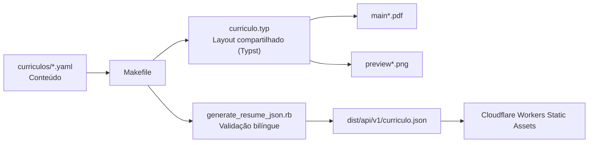

# Contribuindo

Contribuições para o gerador, layout e documentação são bem-vindas. Não inclua dados pessoais, experiências, tecnologias ou métricas que não tenham sido fornecidos pelo titular do currículo.

## Ambiente de desenvolvimento

Instale:

- Typst 0.15 ou superior;
- GNU Make;
- Ruby 3 ou superior (API JSON);
- Poppler (`pdftotext` e `pdfinfo`), para validar os PDFs.

No macOS, as dependências podem ser instaladas com Homebrew:

```bash
brew install typst ruby poppler
```

## Arquitetura



| Arquivo | Responsabilidade |
| --- | --- |
| `curriculos/curriculo.yaml` | Conteúdo do perfil de software. |
| `curriculos/curriculo-en.yaml` | Tradução inglesa do perfil de software para a API estática. |
| `curriculos/curriculo-geral.yaml` | Conteúdo do perfil geral de TI, sistemas e suporte. |
| `scripts/generate_resume_json.rb` | Valida os dois idiomas e gera o contrato JSON público. |
| `curriculo.typ` | Layout compartilhado; lê o YAML indicado em `--input dados=...`. |
| `fonts/` | Fontes Latin Modern Sans usadas no PDF (GUST Font License). |
| `wrangler.jsonc` | Configura a publicação do JSON como Worker somente de assets estáticos. |
| `Makefile` | Orquestra compilação, previews e API estática. |

## Fluxo de alteração

1. Edite o YAML do perfil desejado ou o arquivo compartilhado correspondente.
2. Execute `make software` ou `make geral` quando alterar conteúdo.
3. Execute `make api` ao alterar a fonte inglesa ou o gerador JSON.
4. Execute `make todos` quando alterar o layout, as fontes, o gerador JSON ou o `Makefile`.
5. Confirme que o texto pode ser extraído, que cada PDF permanece em uma página A4 e que o JSON contém os dois idiomas.

```bash
pdftotext main.pdf -
pdfinfo main.pdf
pdftotext main-geral.pdf -
pdfinfo main-geral.pdf
ruby -rjson -e 'JSON.parse(File.read("dist/api/v1/curriculo.json"))'
```

Para compilar manualmente um perfil:

```bash
typst compile --root . --font-path fonts --ignore-system-fonts --input dados=curriculos/curriculo.yaml curriculo.typ main.pdf
```

Inclua no pull request os PDFs e previews regenerados correspondentes às fontes alteradas. Mantenha o layout em uma coluna, sem tabelas ou elementos que prejudiquem a extração de texto por ATS.
