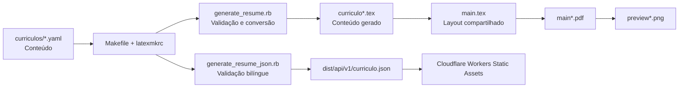

# Contribuindo

Contribuições para o gerador, layout e documentação são bem-vindas. Não inclua dados pessoais, experiências, tecnologias ou métricas que não tenham sido fornecidos pelo titular do currículo.

## Ambiente de desenvolvimento

Instale:

- Ruby 3 ou superior;
- GNU Make;
- uma distribuição LaTeX com `latexmk`, suporte ao idioma português e Latin Modern;
- Poppler (`pdftoppm`, `pdftotext` e `pdfinfo`).

No macOS, as dependências principais podem ser instaladas com Homebrew e MacTeX:

```bash
brew install ruby poppler
brew install --cask mactex-no-gui
```

## Arquitetura



| Arquivo | Responsabilidade |
| --- | --- |
| `curriculos/curriculo.yaml` | Conteúdo do perfil de software. |
| `curriculos/curriculo-en.yaml` | Tradução inglesa do perfil de software para a API estática. |
| `curriculos/curriculo-geral.yaml` | Conteúdo do perfil geral de TI, sistemas e suporte. |
| `scripts/generate_resume.rb` | Valida o YAML, protege caracteres especiais e gera comandos LaTeX. |
| `scripts/generate_resume_json.rb` | Valida os dois idiomas e gera o contrato JSON público. |
| `curriculo*.tex` | Arquivos intermediários gerados; não devem ser editados manualmente. |
| `main.tex` | Layout compartilhado e ponto de entrada do perfil de software. |
| `main-geral.tex` | Seleciona os dados do perfil geral e reutiliza `main.tex`. |
| `wrangler.jsonc` | Configura a publicação do JSON como Worker somente de assets estáticos. |
| `Makefile` e `latexmkrc` | Orquestram geração, compilação, previews e API estática. |

## Fluxo de alteração

1. Edite o YAML do perfil desejado ou o arquivo compartilhado correspondente.
2. Execute `make software` ou `make geral` quando alterar conteúdo.
3. Execute `make api` ao alterar a fonte inglesa ou o gerador JSON.
4. Execute `make todos` quando alterar o layout, geradores, `latexmkrc` ou `Makefile`.
5. Confirme que o texto pode ser extraído, que cada PDF permanece em uma página A4 e que o JSON contém os dois idiomas.

```bash
pdftotext main.pdf -
pdfinfo main.pdf
pdftotext main-geral.pdf -
pdfinfo main-geral.pdf
ruby -rjson -e 'JSON.parse(File.read("dist/api/v1/curriculo.json"))'
```

Para executar manualmente a conversão e a compilação:

```bash
ruby scripts/generate_resume.rb curriculos/curriculo.yaml curriculo.tex
latexmk -pdf -g main.tex
```

Inclua no pull request os PDFs e previews regenerados correspondentes às fontes alteradas. Mantenha o layout em uma coluna, sem tabelas ou elementos que prejudiquem a extração de texto por ATS.
