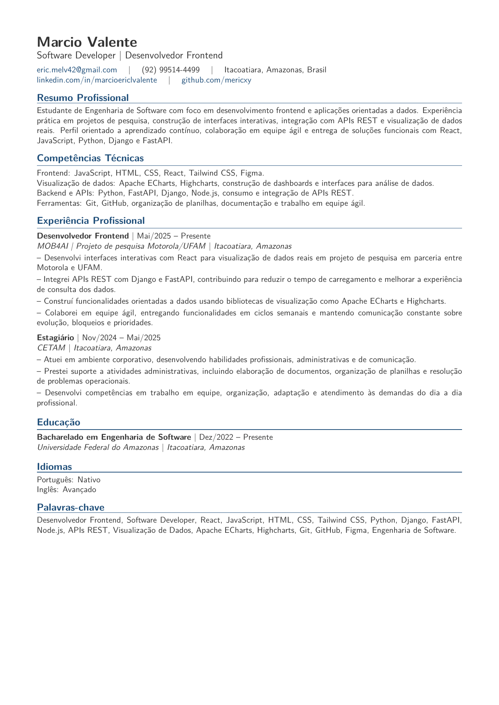

# Curriculo em LaTeX

Curriculo de Marcio Valente em LaTeX, otimizado para leitura humana e para sistemas ATS/modelos de IA.

## Preview

[Abrir PDF](main.pdf)



## Compilar

```bash
latexmk -pdf main.tex
```

O PDF final sera gerado como `main.pdf`.
