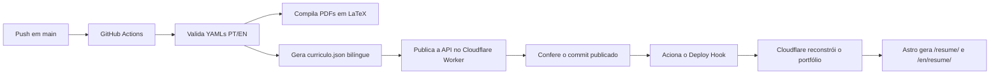

# Currículo como código: YAML → PDF + API

[](https://github.com/mericxy/meu-curriculo/actions/workflows/build.yml)
[](https://github.com/mericxy/meu-curriculo/releases/latest)
[](LICENSE)

O conteúdo do currículo vive em YAML. Cada push em `main` dispara um pipeline que valida os dados, compila os PDFs em LaTeX (layout simples, compatível com ATS), gera uma API JSON bilíngue, publica tudo num Cloudflare Worker e reconstrói o portfólio com as páginas atualizadas — sem etapa manual.


```mermaid
flowchart LR
    PUSH["Push em main"] --> CI["GitHub Actions"]
    CI --> VALIDATE["Valida YAMLs PT/EN"]
    VALIDATE --> PDF["Compila PDFs em LaTeX"]
    VALIDATE --> JSON["Gera curriculo.json bilíngue"]
    JSON --> API["Publica a API no Cloudflare Worker"]
    API --> CHECK["Confere o commit publicado"]
    CHECK --> HOOK["Aciona o Deploy Hook"]
    HOOK --> ASTRO["Cloudflare reconstrói o portfólio"]
    ASTRO --> PAGES["Astro gera /resume/ e /en/resume/"]
```

## Como funciona

1. Você edita só o YAML (`curriculos/curriculo.yaml` e `curriculos/curriculo-en.yaml`).
2. O job `build` valida os dois arquivos, compila os PDFs (`main.pdf` e `main-geral.pdf`, sempre 1 página A4) e gera `dist/api/v1/curriculo.json` com `schemaVersion`.
3. O job `deploy-api` (só roda se o build passar) publica o JSON no Cloudflare Worker, espera o endpoint retornar o mesmo commit e chama o Deploy Hook do [repositório do portfólio](https://github.com/mericxy/portfolio).
4. O portfólio busca o JSON no build do Astro, valida `schemaVersion: 1` e gera as páginas estáticas em português e inglês. Não há servidor de currículo nem `fetch` no navegador. Se a API estiver indisponível ou incompatível, o build falha e a versão anterior do site continua no ar.

A automação usa os repository secrets `CLOUDFLARE_API_TOKEN`, `CLOUDFLARE_ACCOUNT_ID` e `PORTFOLIO_DEPLOY_HOOK_URL`, que não ficam armazenados no repositório.

## Currículos publicados

- **Perfil de software:** [PDF](main.pdf) | [DOCX](curriculo.docx) | [versão web](https://meric.dev.br/resume/)
- **Perfil geral:** [PDF](main-geral.pdf)

A versão web em [meric.dev.br/resume/](https://meric.dev.br/resume/) é gerada a partir da API estática:

```text
https://api.meric.dev.br/v1/curriculo.json
```

## Uso local

Você precisa de Ruby, GNU Make, uma distribuição LaTeX com `latexmk` e Poppler (`pdftoppm`). Depois, execute:

```bash
git clone https://github.com/mericxy/meu-curriculo.git && cd meu-curriculo
${EDITOR:-nano} curriculos/curriculo.yaml
make software
```

O currículo será gerado em `main.pdf`, com um preview em `preview.png`. Edite apenas o YAML; `curriculo.tex` é um arquivo intermediário gerado automaticamente.

Ao criar seu próprio currículo, substitua os dados pessoais, links, experiências e projetos de `curriculos/curriculo.yaml`. Remova também os artefatos pessoais que não quiser manter no seu repositório.

| Comando | Resultado |
| --- | --- |
| `make` ou `make software` | Gera `main.pdf` e `preview.png` usando `curriculos/curriculo.yaml`. |
| `make geral` | Gera `main-geral.pdf` e `preview-geral.png` usando `curriculos/curriculo-geral.yaml`. |
| `make api` | Valida os YAMLs português e inglês e gera `dist/api/v1/curriculo.json`. |
| `make todos` | Atualiza os dois PDFs, seus previews e a API estática. |

A conversão de YAML usa Ruby e sua biblioteca padrão, sem gems adicionais. O Make verifica as datas dos arquivos e repete apenas as etapas necessárias. O diretório `dist/` é gerado localmente e não é versionado.

## Adicionar outro perfil

Crie `curriculos/curriculo-<perfil>.yaml` e um pequeno `main-<perfil>.tex` que selecione esses dados e inclua `main.tex`. Em seguida, adicione ao `Makefile` um alvo equivalente a `geral`. Dessa forma, cada perfil mantém conteúdo próprio e reutiliza o mesmo layout.

## Desenvolvimento

A arquitetura interna, o fluxo de compilação manual e as regras para contribuir estão em [CONTRIBUTING.md](CONTRIBUTING.md). Pull requests são validados pelo workflow de build, que compila os dois perfis e verifica se os PDFs continuam com uma página em formato A4.

## Licença

O código-fonte e os arquivos reutilizáveis do template são distribuídos sob a [licença MIT](LICENSE). Dados pessoais, textos dos currículos e artefatos publicados (`curriculos/*.yaml`, PDFs, DOCX e previews) não fazem parte dessa licença.
