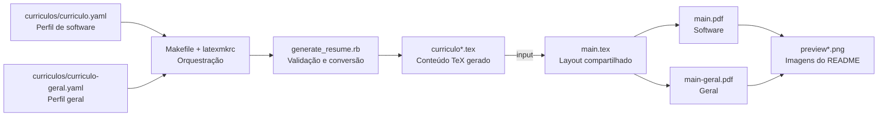

# Currículos em YAML e LaTeX

Currículos de Marcio Valente com conteúdo em YAML e layout compartilhado em LaTeX, otimizados para leitura humana e para sistemas ATS/modelos de IA. Disponível também em versão web interativa em [meric.dev.br/resume](https://meric.dev.br/resume/).

## Preview

### Perfil de software

[Abrir PDF](main.pdf) | [Baixar DOCX](curriculo.docx) | [Versão Web](https://meric.dev.br/resume/)


### Perfil geral

[Abrir PDF](main-geral.pdf)


## Como funciona

Cada versão do currículo possui seu próprio YAML, mas todas usam o mesmo gerador e o mesmo layout. Assim, os perfis podem ter resumo, competências, projetos e informações adicionais diferentes sem manter uma branch separada para cada versão.


```mermaid
flowchart LR
    SOFTWARE["curriculos/curriculo.yaml<br/>Perfil de software"]
    GERAL["curriculos/curriculo-geral.yaml<br/>Perfil geral"]
    BUILD["Makefile + latexmkrc<br/>Orquestração"]
    SCRIPT["generate_resume.rb<br/>Validação e conversão"]
    DATA["curriculo*.tex<br/>Conteúdo TeX gerado"]
    LAYOUT["main.tex<br/>Layout compartilhado"]
    SOFTWARE_PDF["main.pdf<br/>Software"]
    GERAL_PDF["main-geral.pdf<br/>Geral"]
    PREVIEWS["preview*.png<br/>Imagens do README"]

    SOFTWARE --> BUILD
    GERAL --> BUILD
    BUILD --> SCRIPT
    SCRIPT --> DATA
    DATA -->|input| LAYOUT
    LAYOUT --> SOFTWARE_PDF
    LAYOUT --> GERAL_PDF
    SOFTWARE_PDF --> PREVIEWS
    GERAL_PDF --> PREVIEWS
```

| Arquivo | Responsabilidade |
| --- | --- |
| `curriculos/curriculo.yaml` | Conteúdo do perfil voltado a desenvolvimento de software. |
| `curriculos/curriculo-geral.yaml` | Conteúdo do perfil voltado a TI, sistemas e suporte técnico. |
| `scripts/generate_resume.rb` | Valida os campos, protege caracteres especiais e converte os dados em comandos LaTeX. |
| `curriculo.tex` e `curriculo-geral.tex` | Arquivos intermediários gerados automaticamente. Não devem ser editados manualmente. |
| `main.tex` | Define o layout compartilhado e usa `curriculo.tex` por padrão. |
| `main-geral.tex` | Seleciona `curriculo-geral.tex` e reutiliza o layout de `main.tex`. |
| `Makefile` | Oferece comandos simples para gerar um perfil ou todos os perfis. |
| `latexmkrc` | Detecta mudanças no YAML e executa o gerador durante a compilação. |
| `main*.pdf` e `preview*.png` | PDFs e imagens finais publicados no repositório. |

O conteúdo que antes vivia na branch `curriculo-geral` agora está em `curriculos/curriculo-geral.yaml`. As duas versões podem evoluir juntas na `main`, compartilhando qualquer correção feita no layout ou no gerador.

## Compilar

### Comandos principais

```bash
make software
make geral
make todos
```

| Comando | Resultado |
| --- | --- |
| `make` ou `make software` | Gera `main.pdf` e `preview.png` usando `curriculos/curriculo.yaml`. |
| `make geral` | Gera `main-geral.pdf` e `preview-geral.png` usando `curriculos/curriculo-geral.yaml`. |
| `make todos` | Atualiza as duas versões e seus previews. |

O `make geral`, por exemplo, executa este fluxo:

1. Lê e valida `curriculos/curriculo-geral.yaml`.
2. Gera o arquivo intermediário `curriculo-geral.tex`.
3. Compila `main-geral.tex`, que seleciona esses dados e reutiliza o layout de `main.tex`.
4. Gera `main-geral.pdf` e converte sua primeira página em `preview-geral.png`.

O Make verifica as datas dos arquivos e repete apenas as etapas necessárias. A conversão de YAML usa Ruby e sua biblioteca padrão, sem gems adicionais.

### Compilação manual

Também é possível executar cada etapa diretamente:

```bash
ruby scripts/generate_resume.rb curriculos/curriculo.yaml curriculo.tex
latexmk -pdf -g main.tex

ruby scripts/generate_resume.rb curriculos/curriculo-geral.yaml curriculo-geral.tex
latexmk -pdf -g main-geral.tex
```

Edite somente o YAML correspondente ao perfil. Os arquivos `curriculo*.tex` são gerados e não devem ser alterados manualmente.

### Adicionar outro perfil

Para criar uma nova versão, use o mesmo padrão de nomes:

```bash
curriculos/curriculo-<perfil>.yaml
main-<perfil>.tex
```

O YAML guarda o conteúdo específico. O pequeno arquivo `main-<perfil>.tex` seleciona esse conteúdo e inclui `main.tex`, mantendo o layout centralizado. Depois, basta adicionar ao `Makefile` um alvo equivalente a `geral`.

## Gerar DOCX

```bash
soffice --headless --convert-to odt --outdir . curriculo.html
soffice --headless --convert-to docx --outdir . curriculo.odt
```
