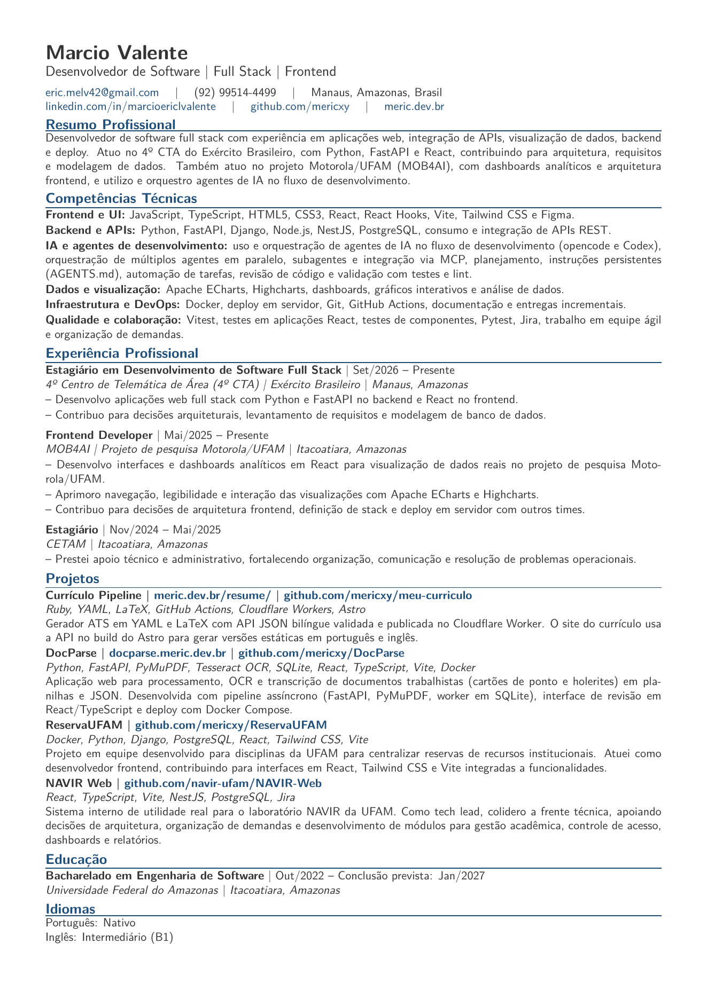
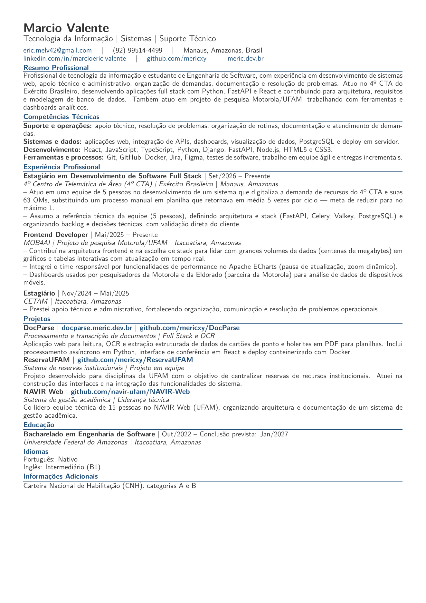

# Currículos em YAML e LaTeX

[](https://github.com/mericxy/meu-curriculo/actions/workflows/build.yml)
[](https://github.com/mericxy/meu-curriculo/releases/latest)
[](LICENSE)

Crie currículos em PDF e JSON a partir de conteúdo YAML. Os PDFs usam um layout LaTeX simples, legível e compatível com sistemas ATS. Este repositório também mantém os currículos de Marcio Valente e uma [versão web interativa](https://meric.dev.br/resume/).

## Crie seu currículo

Você precisa de Ruby, GNU Make, uma distribuição LaTeX com `latexmk` e Poppler (`pdftoppm`). Depois, execute:

```bash
git clone https://github.com/mericxy/meu-curriculo.git && cd meu-curriculo
${EDITOR:-nano} curriculos/curriculo.yaml
make software
```

O currículo será gerado em `main.pdf`, com um preview em `preview.png`. Edite apenas o YAML; `curriculo.tex` é um arquivo intermediário gerado automaticamente.

Ao criar seu próprio currículo, substitua os dados pessoais, links, experiências e projetos de `curriculos/curriculo.yaml`. Remova também os artefatos pessoais que não quiser manter no seu repositório.

## Currículos publicados

### Perfil de software

[Abrir PDF](main.pdf) | [Baixar DOCX](curriculo.docx) | [Versão web](https://meric.dev.br/resume/)



### Perfil geral

[Abrir PDF](main-geral.pdf)



## API estática

O perfil de software está disponível em português e inglês como JSON estático versionado:

```text
https://api.meric.dev.br/v1/curriculo.json
```

`curriculos/curriculo.yaml` e `curriculos/curriculo-en.yaml` são validados e convertidos pelo script `scripts/generate_resume_json.rb`. Em pushes para `main`, o GitHub Actions publica o resultado em um Cloudflare Worker que serve somente assets estáticos.

O documento possui `schemaVersion`, metadados da fonte e os conteúdos `pt-BR` e `en`. A entrega utiliza os headers padrão de Workers Static Assets, incluindo `Cache-Control: public, max-age=0, must-revalidate` e `ETag`.

## Comandos

| Comando | Resultado |
| --- | --- |
| `make` ou `make software` | Gera `main.pdf` e `preview.png` usando `curriculos/curriculo.yaml`. |
| `make geral` | Gera `main-geral.pdf` e `preview-geral.png` usando `curriculos/curriculo-geral.yaml`. |
| `make api` | Valida os YAMLs português e inglês e gera `dist/api/v1/curriculo.json`. |
| `make todos` | Atualiza os dois PDFs, seus previews e a API estática. |

A conversão de YAML usa Ruby e sua biblioteca padrão, sem gems adicionais. O Make verifica as datas dos arquivos e repete apenas as etapas necessárias. O diretório `dist/` é gerado localmente e não é versionado.

## Adicionar outro perfil

Crie `curriculos/curriculo-<perfil>.yaml` e um pequeno `main-<perfil>.tex` que selecione esses dados e inclua `main.tex`. Em seguida, adicione ao `Makefile` um alvo equivalente a `geral`. Dessa forma, cada perfil mantém conteúdo próprio e reutiliza o mesmo layout.

## Desenvolvimento

A arquitetura interna, o fluxo de compilação manual e as regras para contribuir estão em [CONTRIBUTING.md](CONTRIBUTING.md). Pull requests são validados pelo workflow de build, que compila os dois perfis e verifica se os PDFs continuam com uma página em formato A4.

## Licença

O código-fonte e os arquivos reutilizáveis do template são distribuídos sob a [licença MIT](LICENSE). Dados pessoais, textos dos currículos e artefatos publicados (`curriculos/*.yaml`, PDFs, DOCX e previews) não fazem parte dessa licença.
